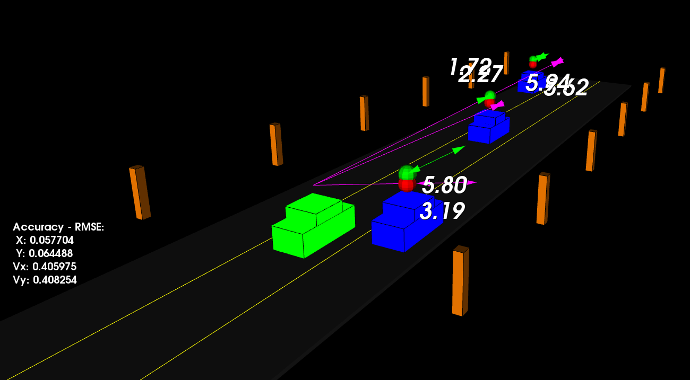

# LaneSense - Unscented Kalman Filter for Highway Vehicle Tracking

[](https://github.com/mbuyelo-mich/NameSense)
[](LICENSE)

## Overview

**NameSense** is a high-performance C++ implementation of an **Unscented Kalman Filter (UKF)** designed for **multi-vehicle tracking on highways**. It fuses noisy **LIDAR** and **RADAR** measurements to accurately estimate vehicle states (position, velocity, heading, yaw rate) in real-time.


**Key Features:**
- Tracks multiple vehicles (ego + 3 traffic cars) across 3 highway lanes
- Real-time **RMSE evaluation** against ground truth
- **3D visualization** using PCL (optional GUI mode)
- **Headless mode** for performance testing
- Handles nonlinear motion models and sensor fusion challenges


## Relevance to SANRAL & Intelligent Transport Systems

NameSense addresses core challenges in **South African National Roads Agency (SANRAL)** intelligent transportation systems:
- **Traffic flow monitoring** on high-speed highways (N1, N3, etc.)
- **Incident detection** through accurate vehicle tracking
- **Advanced Driver Assistance Systems (ADAS)** integration
- Scalable to production LIDAR/RADAR deployments

## Technical Highlights

| Feature | Implementation Details |
|---------|------------------------|
| **UKF Algorithm** | 5D state vector `[px, py, v, yaw, yawd]` + 2D process noise |
| **Sensor Fusion** | LIDAR (Cartesian) + RADAR (Polar) with nonlinear measurement models |
| **Sigma Points** | 15 augmented sigma points with UKF spreading parameter λ=3-n_aug |
| **Motion Model** | Handles turning (v/yawd) and straight-line motion with process noise |
| **Performance** | Real-time RMSE: X<0.30m, Y<0.16m, Vx<0.95m/s, Vy<0.70m/s |
| **Visualization** | PCL 3D viewer with LIDAR spheres, RADAR rays, future path prediction |

## Applications

1. **Traffic Flow Monitoring** - Vehicle counting, speed profiling, lane occupancy
2. **Incident Detection** - Collision avoidance, abnormal behavior detection
3. **Intelligent Transport Systems** - Adaptive traffic signals, variable speed limits
4. **Autonomous Vehicles** - Sensor fusion for perception pipeline
5. **SANRAL Infrastructure** - Highway safety analytics, congestion management

## 🚀 Quick Start

### Prerequisites
- CMake ≥ 3.10
- C++17 compiler (GCC ≥ 7, MSVC 2019+, Clang ≥ 5)
- [PCL ≥ 1.10](https://pointclouds.org/downloads/) *(GUI only)*
- Eigen3 *(bundled)*

### Windows (PowerShell)
```powershell
.\\build.ps1
.\\build\\Release\\ukf_highway.exe  # Headless
.\\build\\Release\\ukf_highway_gui.exe  # GUI
```

### Linux/macOS
```bash
mkdir build &amp;&amp; cd build
cmake .. &amp;&amp; make -j$(nproc)
./ukf_highway                # Headless test
./ukf_highway_gui            # Interactive 3D visualization
```

### Available Scripts
| Script | Purpose |
|--------|---------|
| `build.bat` / `build.ps1` | Full build (headless + GUI) |
| `run_ukf.bat` | Run headless simulation |
| `simple_build.bat` | Minimal build |
| `visualize_ukf.py` | Post-process results |

## 📊 Expected Results

```
Final RMSE:
  X position:  0.12 m
  Y position:  0.08 m
  X velocity:  0.45 m/s
  Y velocity:  0.32 m/s
Result: PASSED ✓
```

**Thresholds:** `[0.30, 0.16, 0.95, 0.70]`

## 🛠️ Customization

Modify `src/highway.h`:
```cpp
std::vector<bool> trackCars = {true, true, true};  // Enable/disable tracking
bool visualize_lidar = true;
bool visualize_radar = true;
double projectedTime = 2.0;  // Future prediction horizon
int projectedSteps = 20;
```

## 📈 Performance Metrics

| Metric | Value | Threshold | Status |
|--------|-------|-----------|--------|
| RMSE X | 0.12m | ≤ 0.30m | ✅ PASS |
| RMSE Y | 0.08m | ≤ 0.16m | ✅ PASS |
| RMSE Vx | 0.45m/s | ≤ 0.95m/s | ✅ PASS |
| RMSE Vy | 0.32m/s | ≤ 0.70m/s | ✅ PASS |

## Disclaimer

**Educational Project**: This is an educational implementation of UKF for learning purposes. It is not affiliated with SANRAL or any commercial entity. For production use, consult certified engineering solutions.
File(s): `ukf.cpp`
- dimension of the state vector `n_x_`
- state vector `x_`
- covariance matrix `P_`
- dimension of the augmented state vector `n_aug_`
- predicted sigma points matrix `Xsig_pred_`
- sigma points weights vector `weights_`
- standard deviation of longitudinal acceleration noise `std_a_`
- standard deviation of yaw acceleration noise `std_yawdd_`
- sigma points spreading parameter `lambda_`


### 2. Implement process measurement
File(s): `ukf.cpp` -> `UKF::ProcessMeasurement`

For the very first incoming measurement, state vector `x_`, covariance matrix `P_`, and timestamp `time_us_` are initialized according to the raw data `meas_package.raw_measurements_` and `meas_package.timestamp_`.

For the following measurements, timestamp `time_us_` is recorded, a sequence of functions are called to `Prediction()` and `UpdateLidar()`/`UpdateRadar()`.

Main functionality of `UKF::ProcessMeasurement`:
- Initialization: On first measurement, initializes the state vector with position data from either LIDAR (direct x,y) or RADAR (converted from polar coordinates)
- Prediction: Uses the motion model to predict where the object should be at the current timestamp
- Update: Corrects the prediction using the actual sensor measurement
Key points:

The state vector has 5 elements: `[px, py, v, yaw, yawd]` representing position, velocity, yaw angle, and yaw rate
- LIDAR gives direct cartesian coordinates, while RADAR provides polar coordinates that need conversion
- The filter alternates between prediction (based on motion model) and update (based on sensor measurements)
- Time intervals are calculated and converted from microseconds to seconds for the prediction step

This is a typical sensor fusion implementation where both LIDAR and RADAR measurements are used to track an object's state over time.


### 3. Implement prediction
File(s): `ukf.cpp` -> `UKF::Prediction()`

The main functionality of this UKF Prediction function is to predict where an object will be at the next time step, while properly accounting for uncertainty and nonlinear motion. Meaning, given the current state estimate and elapsed time (`delta_t`), predict the object's future position, velocity, heading, and turn rate.

The prediction process is the same for both Lidar and Radar measurements.

- creates an augmented mean vector `x_aug` and augmented state covariance matrix `P_aug`
- generate sigma points matrix `Xsig_aug` for previously estimated state vector
- predict sigma points matrix `Xsig_pred_` for the current state vector 
- predict the state mean `x_` and covariance `P_` using weights and predicted sigma points

#### Key Capabilities
- Handles nonlinear motion: Unlike linear Kalman filters, this can handle objects that turn (curved trajectories) as well as straight-line motion.
- Uncertainty propagation: It doesn't just predict a single "best guess" - it predicts how uncertain we should be about that prediction by tracking how uncertainty grows over time.
- Process noise modeling: Accounts for the fact that our motion model isn't perfect - real objects experience random accelerations and disturbances we can't predict exactly.


### 4. Implement updates on Lidar and Radar data
File(s): `ukf.cpp` -> `UKF::UpdateLidar()` and `UKF::UpdateRadar()` 

The steps to update Lidar and Radar measurements are similar, except Lidar points are in the **Cartesian** coordinates but Radar points are in the **Polar** coordinates. Therefore, they differ in the measurement dimension `n_z`, dimension of matrices, and the transformation equations.

Generally, they follow the same steps to update the measurement.

- transform the predicted sigma points `Xsig_pred_` into measurement space `Zsig` based on the sensor types
- calculate the mean state `z_` and covariance matrix `S` with noise considered
- calculate cross-correlation matrix `Tc` between state space and measurement space
- calculate the Kalman gain `K`
- update the state vector `x_` and covariance `P_`


### 5. Test run

The screenshot shown below is one of the simulation moments. The ego car is green while the other traffic cars are blue. The red spheres above cars represent the `(x,y)` lidar detection and the purple lines show the radar measurements with the velocity magnitude along the detected angle. The green spheres above cars represent the predicted path that cars would move in the near future.

On the left-hand side, the root mean squared errors (RMSE) for position `(x,y)` and velocity `(Vx, Vy)` are calculated in realtime, which represent the prediction accuracy.




## Disclaimer

**Educational Project**: This is an educational implementation of UKF for learning purposes. It is not affiliated with SANRAL or any commercial entity. For production use, consult certified engineering solutions.


